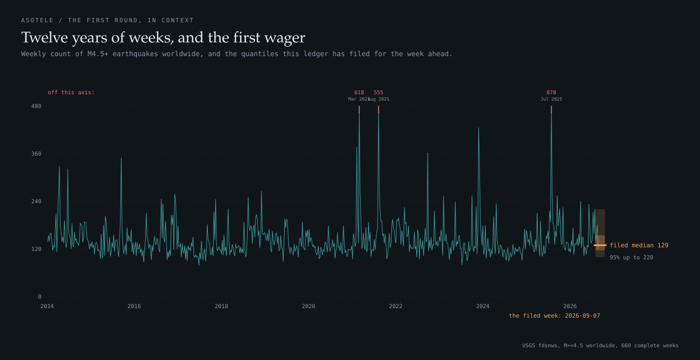
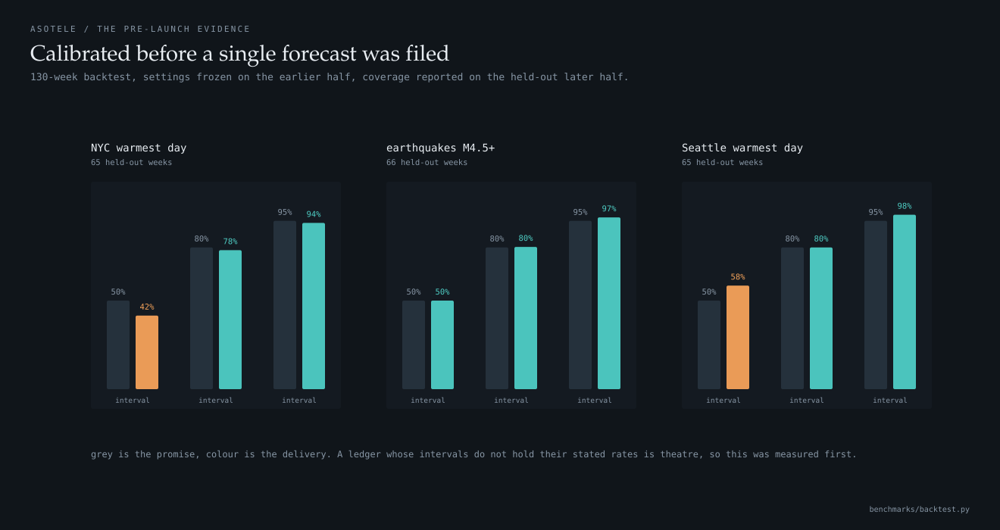
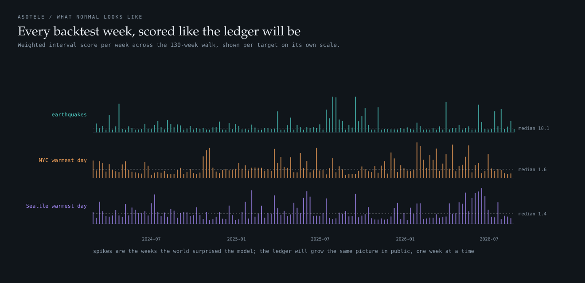
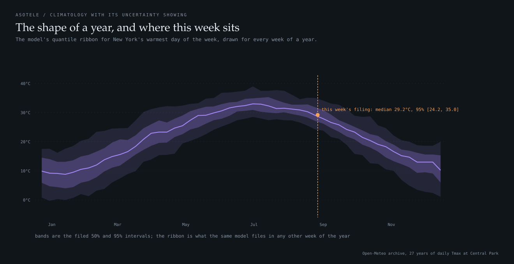

# asotele

A public forecast ledger: predictions filed before the fact, scored against
reality by a proper rule, forever.

**The scoreboard is live: [kenny0bi.github.io/asotele](https://kenny0bi.github.io/asotele/)**

Every week this repository commits probabilistic forecasts (23 quantiles) of
verifiable public quantities, then scores them once the outcomes exist.
Nothing is deleted and nothing can be: the git history is the notary, and
every row on the scoreboard links to the commit that proves the forecast
preceded the outcome.

Most forecasting claims you meet are made after the fact, or scored by their
maker, or quietly pruned. This is the opposite bet: a permanent record of
being right and wrong in public, opened knowing the misses will sit on it
with the same weight as the hits.

*asotele* is Yoruba for prophecy.

## What gets forecast

Three quantities with public, keyless truth sources and written resolution
rules ([asotele/targets.py](asotele/targets.py)):

| target | truth source | why it is hard |
|---|---|---|
| Worldwide count of M4.5+ earthquakes, per week | USGS fdsnws | heavy upper tail: one great earthquake's aftershocks can quadruple a week |
| Warmest daily maximum in Central Park, per week | Open-Meteo archive | weather beyond day 5 is mostly climate plus honesty about variance |
| Warmest daily maximum at Seattle-Tacoma, per week | Open-Meteo archive | a different climate, so calibration cannot be one city's luck |

Each target's truth procedure includes a maturity delay (7 days past the week's
end) so source revisions settle before scoring, and whatever the API returns at
scoring time is final for the ledger.



## The rules, fixed in advance

1. **Filed first.** A forecast for the week of Monday M must be committed
   before M. The commit timestamp is the proof; the scoreboard links to it.
2. **Scored by a proper rule.** The weighted interval score, which is twice
   the mean pinball loss across the 23 levels. Proper means the expected score
   is minimised by stating your true beliefs: there is no strategy that beats
   honesty, so the only way to look good is to be right.
3. **Nothing leaves.** Scores append. A bad week stays forever.
4. **The reference is named.** Every score is also reported relative to a
   naive reference (persistence for earthquakes, flat climatology for
   temperature), so "beat something" has a stated something.


(Source: [assets/manim_proper.py](assets/manim_proper.py), video in
[assets/proper.mp4](assets/proper.mp4).)

## Calibrated before launch

A ledger whose intervals do not hold their stated rates is theatre, so the
forecasters were validated first: a 130-week backtest, settings frozen on the
earlier half, coverage reported on the held-out later half.



| target | 50% interval held | 80% | 95% |
|---|---|---|---|
| earthquakes | 50% | 80% | 97% |
| NYC warmest day | 42% | 79% | 94% |
| Seattle warmest day | 59% | 80% | 99% |

The models are deliberately simple: trailing ten-year empirical quantiles for
the earthquake count, windowed climatology with a decade-trend shift and a
selection-half-chosen widening for temperature. Simple is the point. The
protocol is what this repository is about, and a simple model that knows its
own uncertainty beats a clever one that does not.





## How it runs

A GitHub Action fires every Friday: it scores whatever has matured, files the
next week's forecasts, rebuilds the scoreboard, and commits. The ledger's
contracts run before and after, so a malformed round can never be committed:

- forecasts must predate their target week
- quantiles must be complete, finite, and monotone
- a score without its forecast is a fabrication and fails the build
- maturity delays cannot be skipped

```bash
pip install numpy pandas scipy requests

python tests/test_ledger.py       # 8 contracts
python benchmarks/backtest.py     # the pre-launch validation, ~3 min
python -c "from asotele.protocol import make_round; make_round()"
python assets/make_site.py        # rebuild the scoreboard
```

## Honest limits

- **Three targets is a start, not a benchmark.** More get added only with the
  same written resolution rules, and additions never touch existing rounds.
- **The reference forecasts are humble.** Beating persistence and climatology
  is table stakes, not glory; the relative-skill column says which weeks even
  that failed.
- **Truth sources can revise after scoring.** The maturity delay absorbs most
  of it; whatever remains is accepted as the cost of finality, and the ledger
  records what the source said at scoring time.
- **The first weeks are an empty scoreboard.** That is what honest looks like
  before the outcomes arrive.

## Layout

- [asotele/targets.py](asotele/targets.py) what is forecast and exactly how
  truth is decided
- [asotele/models.py](asotele/models.py) the forecasters, with their backtest
  evidence in the docstrings
- [asotele/scoring.py](asotele/scoring.py) pinball, WIS, interval tallies
- [asotele/protocol.py](asotele/protocol.py) rounds, scoring, the ledger
- [forecasts/](forecasts/) one frozen file per week, notarised by git
- [scores/](scores/) one file per matured week
- [docs/](docs/) the scoreboard, rebuilt weekly

## Reading

- Gneiting and Raftery (2007), *Strictly proper scoring rules, prediction,
  and estimation*, JASA. Why propriety is the anti-gaming property.
- Bracher, Ray, Gneiting, Reich (2021), *Evaluating epidemic forecasts in an
  interval format*. The WIS used here, shared with my
  [harmattan](https://github.com/Kenny0bi/harmattan) FluSight work.
- Tetlock and Gardner (2015), *Superforecasting*. The case for keeping score
  at all.
